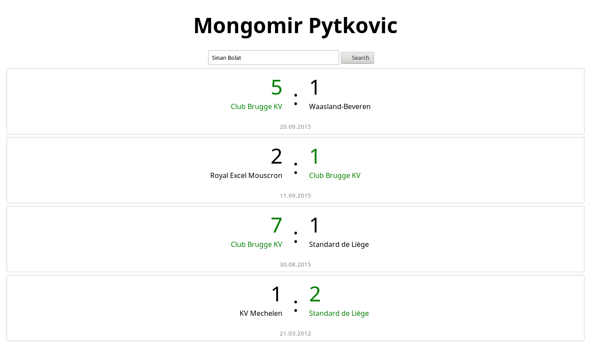
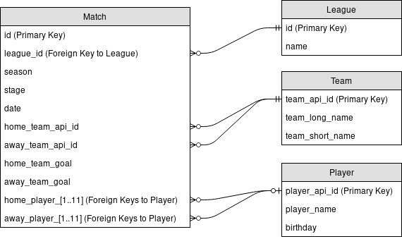

# Autoren {-}

- Lukas Arnold: Queries, REST-API
- Patrick Bucher: Entwicklungsumgebung, Migration
- Christopher James Christensen: Web-Interface
- Jonas Kaiser 
- Melvin Werthmüller: Queries

# Informationen zum Projekt {-}

Das Projekt wurde im Herbstsemester 2017 im Rahmen des Moduls Datenbanksysteme
(DBS) bei Prof. Dr. Michael Kaufmann umgesetzt. Sämtliche Daten zu diesem
Projekt sind auf [GitHub](https://github.com/patrickbucher/mongomir-pytkovic)
verfügbar. Es basiert auf Docker. Das
[README](https://github.com/patrickbucher/mongomir-pytkovic/blob/master/README.md)
gibt Auskunft, wie man die Anwendung zum Laufen bringen kann. Auf Mac OS und
Windows ist eine virtuelle _Docker Machine_ vorausgesetzt, auf Linux
funktioniert es ohne weitere Vorkehrungen.

\newpage

# Einführung

## Was ist der Kontext, warum ist das Projekt relevant, und worum geht es?

Im Projekt _Mongomir Pytkovic_ geht es darum, eine SQLite-Datenbank auf eine
NoSQL-Datenbank zu migrieren und Anfragen auf diese NoSQL-Datenbank abzusetzen
und darzustellen. Der Name «Mongomir Pytkovic» bezieht sich auf den
Nationaltrainer der Schweizer Fussballnationalmannschaft Vladimir Petkovic und
die eingesetzten Technologien MongoDB und Python.

Als Datenbasis wird die [European Soccer
Database](https://www.kaggle.com/hugomathien/soccer/data) verwendet. Hierbei
handelt es sich um ein Beispieldatenbank der Machine-Learning-Plattform und
-Community [Kaggle](https://www.kaggle.com/). Die Datenbank soll es einem
Trainer erlauben, Ergebnisse von Fussballspielen zu finden, in denen ein
bestimmter Spieler beteiligt war.

# Datenmanagement

## Um welche Datenbanktechnologie handelt es sich?

Die Ausgangsdatenbank liegt als [SQLite](https://www.sqlite.org/)-Datenbank
(Version 3) vor. Hierbei handelt es sich um eine relationale Datenbank, die in
einer einzigen Datei vorliegt.

Die Datenbank wird nach [MongoDB](https://www.mongodb.com/) migriert. Hierbei
handelt es sich um eine NoSQL-Datenbank -- genauer um eine Dokumentdatenbank,
die JSON-Datenstrukturen abspeichert.

## Welche Anwendungen (Use Case) unterstützt ihre Datenbank?

- Der Benutzer gibt einen Spielernamen in ein Web-Interface ein 
  und bekommt sämtliche Spielergebnisse angezeigt, in denen
  der jeweilige Spieler beteiligt war(en).
- Der Benutzer gibt einen Spielernamen in ein Web-Interface ein
  und bekommt das Geburtsdatum des Spielers
- Der Benutzer erhält die Anzahl Spiele pro League

## Welche Daten werden migriert/eingefügt, und wie genau?

Grundsätzlich sollen die Einträge der Tabelle `Match`, welche ein Spielergebnis
repräsentiert, migriert werden. Die Tabelle `Match` enthält neben statistischen
Angaben auch Spalten mit den einzelnen beteiligten Spieler als Fremdschlüssel
auf die Tabelle `Player`. Ziel der Migration ist es, diese
Fremdschlüsselbeziehung zu beseitigen und die Spieler der am Spiel beteiligten
Mannschaften direkt mit Namen und Geburtsdatum (zur Identifikation bei mehrfach
auftretenden Namen) als Aggregat der JSON-Struktur `match` abzuspeichern.

Da die Aufgabenstellung auch eine Abfrage mit einem Join umfasst, wird
zusätzlich die Entität `League` migriert. Zu jedem Spiel wird ein Fremdschlüssel
zur jeweiligen Liga abgespeichert.

## Wie interagiert der Benutzer mit der Datenbank?

Der Benutzer interagiert über ein Webinterface mit der Datenbank.



# Datenmodellierung

## Welches Datenmodell (ER) liegt ihrem Projekt zugrunde?



Dies ist ein Auszug aus dem ER-Modell, der nur die Tabellen und Spalten enthält,
die auch tatsächlich in die Dokumentdatenbank migriert werden sollen:

- `League`
    - `id`
    - `name` (Land und Name, z.B. «Switzerland Super League»)
- `Match`
    - `id` (Primärschlüssel)
    - `league_id` (Fremdschlüssel auf `League`)
    - `season` (Saison, z.B. «2009/2010»)
    - `stage` (Spieltag, z.B. 18)
    - `date` (Date-Time mit fehlender Uhrzeit, z.B. «2010-03-30 00:00:00»)
    - `home_team_api_id` (Fremdschlüssel auf `Team`)
    - `away_team_api_id` (dito)
    - `home_team_goal` (erzielte Tore, z.B. 3)
    - `away_team_goal` (dito)
    - `home_player_1` bis `home_player_11` (Fremdschlüssel auf `Player`)
    - `away_player_1` bis `away_player_11` (dito)
- `Player`
    - `player_api_id` (Primärschlüssel)
    - `player_name`
    - `birthday` (Date-Time mit fehlender Uhrzeit, z.B. «1991-07-19 00:00:00»)
- `Team`
    - `team_api_id` (Primärschlüssel)
    - `team_long_name` (Name der Mannschaft, z.B. «Real Madrid CF»)
    - `team_short_name` (Kürzel der Mannschaft, z.B. «REA»)

Das komplette Schema ist auf
[Kaggle](https://www.kaggle.com/hugomathien/soccer/data) ersichtlich.

## Wie wird ihr Datenmodell in Ihrer Datenbank in ein Schema übersetzt?

Das Python-Skript `migration.py` fragt die Ausgangsdatenbank über die
`sqlite3`-Library ab und fügt sie mit der `pymongo`-Library in MongoDB über.
Dabei entstehen zwei Arten von Dokumenten:

- `match`
    - `league_id`
    - `season`
    - `date` (die leere Uhrzeitangabe «00:00:00» wird abgeschnitten)
    - `date_timestamp` (das gleiche Datum als Timestamp zur Sortierung)
    - `round`
    - `home_team` (der String wird UTF-8 kodiert)
    - `away_team` (dito)
    - `home_goals`
    - `away_goals`
    - `home_players` und `away_players`
        - `name`
        - `birthday`
- `league`
    - `id`
    - `league` und `country` (unter String-Aufspaltung von `League.name`)

Das Skript läuft folgendermassen ab:

1. Die Verbindung zur SQLite-Datenbank wird erstellt.
2. Die Verbindung zur MongoDB-Datenbank wird erstellt.
3. Es werden sämtliche Spieler in eine Liste geladen (`load_all_players()`)
    - Dies hat den Vorteil, dass beim Abfragen auf die Tabelle `Match` nicht 22
      mal ein Join auf die Tabelle `Spieler` bzw. eine Schleife mit 22
      Unterabfragen gemacht werden muss. Diese Variante hat sich nämlich bei der
      ersten Version des Skripts als äusserst imperformant erwiesen.
4. Es werden sämtliche Spiele abgefragt und verarbeitet.
    - Mit dem Query aus `get_match_query()` werden sämtliche Spiele abgefragt,
      wobei Spiele ohne referenzierte Spieler ignoriert werden.
    - Es wird über das Abfrageergebnis iteriert.
    - In `to_match_dict()` wird die JSON-Struktur zu einem Spiel als
      Python-Dictionary aufgebaut. Dabei werden die Spieler anhand der
      abgefragten Spieler-IDs aus der bei Schritt 3 geladenen Liste extrahiert
      (`extract_players`).
    - Das Dictionary wird in der MongoDB-Collection `matches` abgelegt. Die
      Konvertierung nach JSON erfolgt dabei automatisch bzw. wird über die
      `pymongo`-Library abgehandelt.
    - Die dabei neu erstellte ID des eingefügten `match`-Dokuments wird auf die
      Standardausgabe geloggt.
5. Es werden sämtliche Ligen abgefragt und verarbeitet.
    - Die `to_league_dict()` wird die JSON-Struktur zu einer Liga als
      Python-Dictionary aufgebaut. Dabei wird der als erstes Wort im Liganamen
      abgespeicherte Landesnamen abgespalten und in ein separates Feld
      geschrieben (`split_league_name()`).
    - Das Dictionary wird in der MongoDB-Collection `leagues` abgelegt.
    - Die dabei neu erstellte ID des eingefügten `league`-Dokuments wird auf die
      Standardausgabe geloggt.
6. Zum Schluss wird auf die Standardausgabe geloggt, wie viele `matches` und
   `leagues` eingefügt wurden.

# Datenbanksprachen

## Wie werden Daten anhand einer Query abgefragt?

### SQLite

Die Hauptabfrage auf die Tabelle `Match` mit Joins auf `Player` sieht
folgendermassen aus:

```sql
select Match.id, league_id, season, stage, date,
home_team.team_long_name as home_team_name, home_team.team_short_name,
away_team.team_long_name as away_team_name, away_team.team_short_name,
home_team_api_id, away_team_api_id, home_team_goal, away_team_goal,
home_player_1 as hp1, home_player_2 as hp2, home_player_3 as hp3,
home_player_4 as hp4, home_player_5 as hp5, home_player_6 as hp6,
home_player_7 as hp7, home_player_8 as hp8, home_player_9 as hp9,
home_player_10 as hp10, home_player_11 as hp11,
away_player_1 as ap1, away_player_2 as ap2, away_player_3 as ap3,
away_player_4 as ap4, away_player_5 as ap5, away_player_6 as ap6,
away_player_7 as ap7, away_player_8 as ap8, away_player_9 as ap9,
away_player_10 as ap10, away_player_11 as ap11
from Match
join Team home_team on (Match.home_team_api_id = home_team.team_api_id)
join Team away_team on (Match.away_team_api_id = away_team.team_api_id)
where not home_player_1 is null and not away_player_1 is null
order by league_id asc, stage asc;
```

Die Abfrage auf die Tabelle `Player`:

```sql
select player_api_id as id, player_name as name, birthday from Player
```

Die Abfrage auf die Tabelle `League`:

```sql
select id, name from League
```

### MongoDB

Abfrage des Geburtsdatum eines Spielers, hier für das Beispiel «Sinan Bolat».

```js
db.matches.findOne({
  "home_players.name": "Sinan Bolat"
}, {
  "home_players.$id": 1
}).home_players[0].birthday

db.matches.findOne({
  "away_players.name": "Sinan Bolat"
}, {
  "away_players.$id": 1
}).away_players[0].birthday
```

Die Abfrage für die Anzahl Spiele pro League.

```js
db.matches.aggregate([{
  $group: {
    _id: "$league_id",
    total: {
      $sum: 1
    }
  }
}])
```

Die Abfrage für alle Spiele eines Spielers, hier für das Beispiel «Sinan Bolat».

```js
db.matches.aggregate([{
    $lookup: {
      from: "leagues",
      localField: "league_id",
      foreignField: "id",
      as: "matches_league"
    }
  },
  {
    "$project": {
      "_id": 0,
      "date": 1,
      "date_timestamp": 1,
      "matches_league.league": 1,
      "matches_league.country": 1,
      "round": 1,
      "home_team": 1,
      "home_goals": 1,
      "away_team": 1,
      "away_goals": 1,
      "home_players": 1,
      "away_players": 1
    }
  },
  {
    "$match": {
      "$or": [
        {"home_players.name": "Sinan Bolat"},
        {"aways_players.name": "Sinan Bolat"}
      ]
    }
  },
  {
    "$sort": {date_timestamp: -1}
  }
])
```

# Konsistenzsicherung

## Wie wird die Datensicherheit gewährleistet?

Die Daten sind öffentlich verfügbar und nicht sensibel. Von daher hat
Datensicherheit in diesem Projekt keine hohe Priorität. Die MongoDB-Instanz
läuft jedoch in einem Docker-Container unter Verwendung des Standard-Ports
27017, welcher _nicht_ per `EXPOSE` gegen aussen freigegeben wird. Der Benutzer
kann also nur über eine REST-API bzw. über das Web-Interface mit der Datenbank
interagieren. Hierbei werden nur lesende Zugriffe angeboten.

## Wie können Transaktionen parallel/konkurrierend verarbeitet werden?

Es sind nur lesende Abfragen möglich. Diese können somit beliebig parallelisiert
werden.

# Systemarchitektur

## Wie ist der Server aufgebaut und wie wurde er installiert?

Das System wurde mit Docker aufgebaut. Es basiert auf dem Image
`debian:jessie-slim`. Als Packages werden u.a. `mongodb`, `python3` und
`python3-pip` installiert. Der statische Content (das Web-Interface) wird mit
`nginx` ausgeliefert. Dazu kommt `vim` zum Programmieren innerhalb des
Containers (was bei der Migration hilfreich war) und `curl` zum Aufrufen der
Web-API innerhalb des Containers (was beim Testen hilfreich war).

Neben den Debian-Packages werden folgende Python-Packages installiert:

- `falcon`: Ein schlankes Framework zur Umsetzung einer REST-API
- `gunicorn`: Ein Webserver, der die REST-API über HTTP anbietet
- `pymongo`: Eine Library zum Interagieren mit einer MongoDB
- `sqlite3client`: Eine Library zum Interagieren mit einer SQLite-Datenbank

Zur Ausführung der Migration und des Webservers wird ein Benutzer namens
`developer` angelegt. Das Migrationsskript und die Skripts für die REST-API
werden in den Docker-Container kopiert. Nach der Migration werden die
vorgenommenen Änderungen per `commit` in das Image festgeschrieben, sodass die
Daten der MongoDB nach dem Neustart des Servers immer noch vorhanden sind. Dies
könnte man auch über ein Volume lösen, was jedoch unter Mac OS nicht
funktioniert, zumal die Migration schreibend auf ein Volume zugreifen muss
([Quelle](https://iainhunter.wordpress.com/2016/01/12/avoiding-pitfalls-running-mongo-3-2-in-docker-on-osx/)).

Die REST-API wird innerhalb des Containers über den Port 8000, der statische
Content über Port 8001 angeboten. Da der statische Content und die REST-API über
einen unterschiedlichen Port angeboten werden, wird die [Same-origin
policy](https://developer.mozilla.org/en-US/docs/Web/Security/Same-origin_policy)
verletzt. (Diese besagt, dass eine Seite nur AJAX-Aufrufe auf eine Ressourcen
ausführen darf, die das gleiche Protokoll, den gleichen Hostname und den
gleichen Port verwenden.) Aus diesem Grund ist `nginx` so konfiguriert, dass er
alle Requests mit einer URL gemäss dem Muster `/api/*` an `localhost:8000` und
somit zum `gunicorn`-Server weiterleitet. Aus diesem Grund wird aus dem
Container nur Port 8001 nach aussen freigegeben.

Beim Start des Containers wird das Skript `server-start.sh`
ausgeführt, das sowohl die MongoDB-Instanz als auch die beiden Webserver
startet. Dabei wird das Log der Web-Applikation laufend auf die Standardausgabe
geschrieben. (Der Container läuft interaktiv und nicht als Daemon, sodass die
Logs sofort ersichtlich sind und der Container per Ctrl-C wieder beendet werden
kann.)

## Wie kann die Effizienz von Datenanfragen optimiert werden?

- Wie bereits bei der Migration beschrieben wurde, werden die Spieler zu Beginn
  in eine Liste geladen. Dadurch können rechenintensive Joins bzw. Unterabfragen
  eingespart werden.
- TODO: Weitere (Problem mit Document Size bei Join League zu Matches, umgekehrt
  funktioniert es) [Quelle](https://docs.mongodb.com/v3.4/reference/limits/)

# Vergleich mit relationalen Datenbanken

## Vergleichen Sie ihre NoSQL-Technologie mit SQL-Datenbanken.

- Dokumentdatenbanken wie MongoDB sind nicht für Joins im Sinne von SQL gemacht.
  Aggregiert man die Daten bereits im Einfügen, kann auf Joins verzichtet
  werden.
- TODO: Weitere

# Schlussfolgerungen

## Was haben Sie erreicht, und welche Erkenntnisse haben sie dabei gewonnen?

- Das Aufsetzen einer Docker-Umgebung braucht viel Zeit, gerade wenn sie auf
  verschiedenen Betriebssystemen ausgeführt werden soll. Auf Linux lief die
  Docker-Umgebung am zuverlässigsten, für Mac OS mussten einige Workarounds
  vorgenommen werden, die auch auf Linux zuverlässig funktionierten und so
  wieder zusammengeführt werden konnten. Fazit: Kann die Docker-Umgebung
  zunächst unter Mac OS zum Laufen gebracht werden, sollte sie auch unter Linux
  funktionieren.
- AJAX-Requests funktionieren nur, wenn Protokoll, Hostname und Portnummer der
  anfragenden und angefragten Ressourcen identisch sind. Dies kann zwar zu
  Testzwecken mit einem Plugin umgangen werden, scheitert jedoch im produktiven
  Einsatz. Fazit: Will man AJAX-Requests verwenden, sollte _ein gemeinsamer_
  Webserver für die REST-API und den statischen Content verwendet oder eine
  entsprechende Weiterleitung konfiguriert werden.
- Bei der Migration kann es performanter sein Daten, auf die oft zugegriffen
  wird, anfangs in den Speicher zu laden statt jeweils bei Bedarf aus der
  Datenbank zu lesen. Bei grossen Datenmengen könnte jedoch der Speicher knapp
  werden.

## Wie beurteilt ihre Gruppe die gewählte Datenbanktechnologie, und was sind Vor- und Nachteile?

TODO
